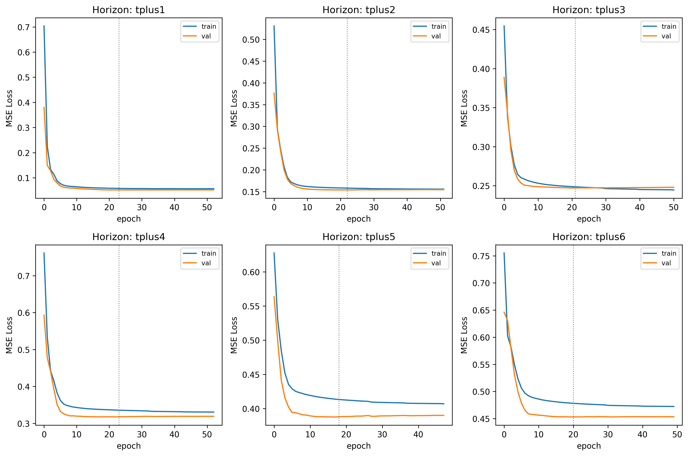
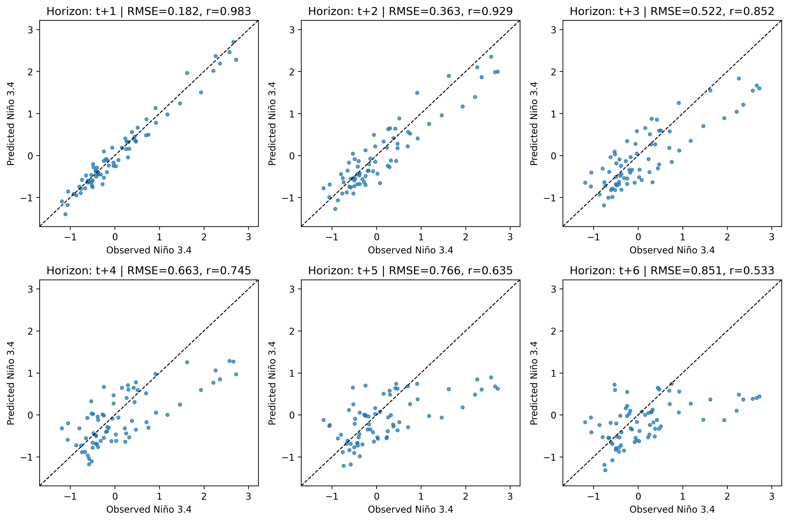
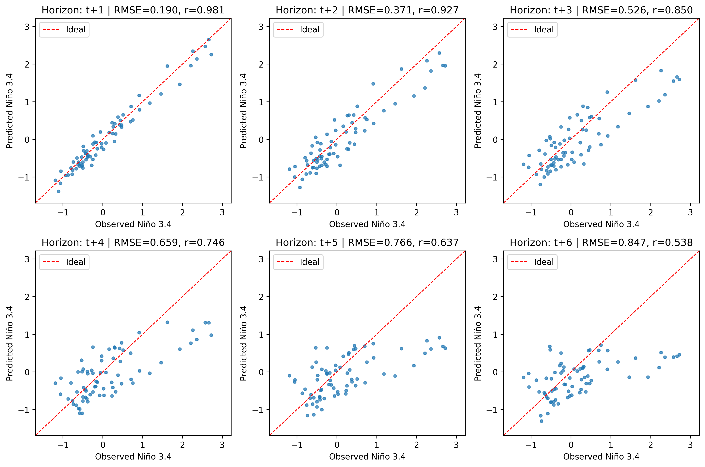

# Niño 3.4 Multi-Horizon Forecasting with Neural Networks

This project builds a neural-network workflow for multi-horizon Niño 3.4 forecasting. It uses recent Niño 3.4 index values to predict the next six monthly horizons and compares independent, shared, weighted, and transfer-learning MLP strategies.

## Project Overview

The main question is whether multi-step forecasting is better handled by separate models for each forecast horizon or by one shared model that predicts all horizons together.

The workflow compares:

* **Single-output MLPs**: one independent neural network for each forecast horizon.
* **Transfer learning for t+6**: a short-horizon model is reused and adapted for the longest forecast horizon.
* **Two-stage transfer learning for t+6**: a new prediction head is trained first, followed by selective fine-tuning.
* **Multi-output MLP**: one shared neural network predicts all six future horizons in a single forward pass.
* **Horizon-weighted multi-output MLP**: a shared model trained with higher loss weights for later forecast horizons.

## Dataset

This repository does not include the original dataset files.

The notebook expects a prepared supervised-learning CSV with monthly Niño 3.4 values, lag features, and six future monthly prediction targets. To rerun the notebook, provide the data locally using one of the following options:

1. Place `Dataset.zip` in the project root, or
2. Place the extracted files under `data/`:

```text
data/Nino3.4_data.csv
data/test_years.csv
```

The expected modelling columns are:

```text
year
month
nino_tminus2
nino_tminus1
nino_t
nino_tplus1
nino_tplus2
nino_tplus3
nino_tplus4
nino_tplus5
nino_tplus6
```

The notebook checks for the extracted CSV files first. If they are already available, it uses them directly. If they are not found, it attempts to extract `Dataset.zip`.

A public-data version can be built from the NOAA PSL Niño 3.4 monthly time series:

https://psl.noaa.gov/data/timeseries/month/Nino34_CPC/

The public NOAA file is a raw monthly time series, so it does not already contain the supervised-learning columns used by this project. To use it, the monthly index values need to be converted into lag features and future forecast targets before running the modelling workflow.

## Repository Structure

```text
.
├── README.md
├── requirements.txt
├── .gitignore
├── Niño_3_4_Multi_Horizon_Forecasting_with_Neural_Networks.ipynb
├── data/
│   └── README.md
└── reports/
    ├── single_output_mlp_metrics.csv
    ├── multi_output_mlp_metrics.csv
    ├── horizon_weighted_vs_multi_output_baseline.csv
    ├── model_comparison_test_metrics.csv
    ├── single_output_mlp_training_histories.png
    ├── multi_output_mlp_test_scatter.png
    └── horizon_weighted_multi_output_test_scatter.png
```

Trained model files and scalers are generated by running the notebook and are intentionally excluded from version control.

## Method

The workflow follows these steps:

1. Prepare the local Niño 3.4 supervised-learning dataset.
2. Split the data into training, validation, and test sets using a year-based test split.
3. Standardise the input features using a scaler fitted only on the training set.
4. Train one MLP per forecast horizon for the single-output baseline.
5. Train transfer-learning variants for the longest forecast horizon.
6. Train a standard multi-output MLP for all six horizons.
7. Train a horizon-weighted multi-output MLP.
8. Evaluate each model using:

   * Root Mean Squared Error (RMSE)
   * Pearson correlation
9. Save comparison tables and diagnostic plots under `reports/`.

## Results

The saved run gives the following average test-set results across the six forecast horizons:

| Model                             | Average RMSE | Average Correlation |
| --------------------------------- | -----------: | ------------------: |
| Single-output MLP                 |       0.5576 |              0.7796 |
| Multi-output MLP                  |       0.5580 |              0.7794 |
| Horizon-weighted multi-output MLP |       0.5597 |              0.7799 |

In this run, the single-output MLP gives the lowest average RMSE, while the horizon-weighted multi-output MLP gives the highest average correlation. The differences are small, so the result is best interpreted as a controlled model comparison rather than a general claim that one architecture is always better.

Detailed horizon-level metrics are available in:

```text
reports/model_comparison_test_metrics.csv
reports/single_output_mlp_metrics.csv
reports/multi_output_mlp_metrics.csv
reports/horizon_weighted_vs_multi_output_baseline.csv
```

## Example Outputs

### Single-output MLP training histories



### Standard multi-output MLP test scatter plots



### Horizon-weighted multi-output MLP test scatter plots



## How to Run

### 1. Clone the repository

```bash
git clone https://github.com/MackintoshCHN/nino34-multi-horizon-forecasting.git
cd nino34-multi-horizon-forecasting
```

### 2. Create an environment

```bash
python -m venv .venv
```

Activate it:

```bash
# macOS / Linux
source .venv/bin/activate

# Windows
.venv\Scripts\activate
```

### 3. Install dependencies

```bash
pip install -r requirements.txt
```

### 4. Add the local dataset files

Use one of the following options:

```text
Dataset.zip
```

or:

```text
data/Nino3.4_data.csv
data/test_years.csv
```

See `data/README.md` for more details.

### 5. Run the notebook

```bash
jupyter notebook Niño_3_4_Multi_Horizon_Forecasting_with_Neural_Networks.ipynb
```

The notebook supports both local execution and Google Colab-style execution. In a local clone, it uses the repository folder as the project root. In Colab, the dataset archive or extracted CSV files should be placed in the expected project workspace before running the data preparation cells.

## Notes and Limitations

* The repository includes code, notebook outputs, metric tables, and result figures.
* Raw local dataset files, trained model files, and scaler files are not included.
* The model uses only recent Niño 3.4 lag values as input features.
* This is a compact neural-network forecasting experiment, not an operational ENSO forecasting system.
* Results may vary slightly depending on random seeds, hardware, TensorFlow version, and dataset split.
* The public NOAA PSL time series can be used to rebuild a similar supervised-learning table, but it needs preprocessing before it matches the modelling format used here.

## References

* NOAA Physical Sciences Laboratory. *Niño 3.4 SST Index from the NOAA ERSST V5*.
  https://psl.noaa.gov/data/timeseries/month/Nino34_CPC/
* NOAA Physical Sciences Laboratory. *Climate Indices: Monthly Atmospheric and Ocean Time Series*.
  https://psl.noaa.gov/data/timeseries/month/
